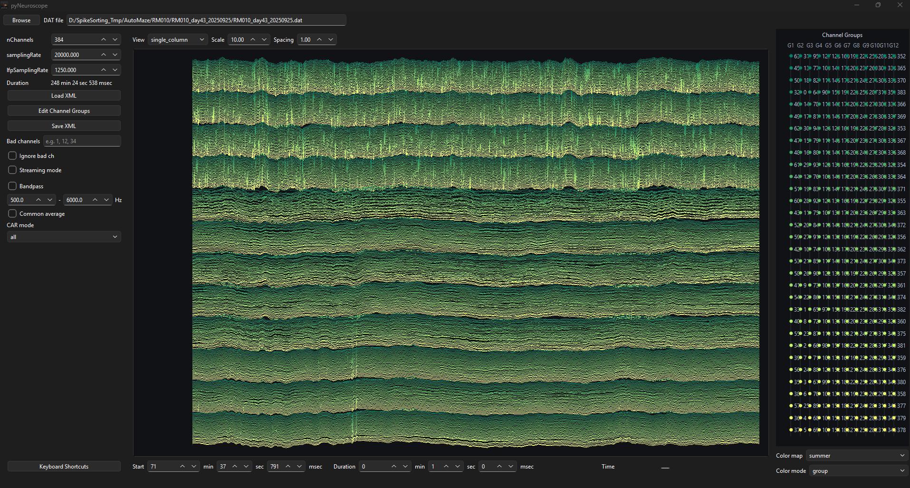

# pyNeuroscope

pyNeuroscope is a Python desktop app inspired by NeuroScope for inspecting electrophysiology recordings and creating NeuroSuite compatible `amplifier.xml` files.

It is designed for quick visual checks of `amplifier.dat`, channel grouping, bad-channel marking, color-map assignment, and XML export for downstream preprocessing workflows.



## Features

- Preview interleaved `int16` `amplifier.dat` recordings by time window.
- Switch between single-column and group-column trace views.
- Scroll through time with the time bar or Left / Right keys.
- Change the displayed time window with `Ctrl + mouse wheel` over the traces.
- Adjust trace scale, row spacing, bandpass filtering, and common-average reference.
- Edit channel groups and inspect groups in the probe viewer.
- Mark bad channels and save them as `skip="1"` in XML.
- Apply channel colors with selectable color maps.
- Choose color mode:
  - `all`: assign the color map across channels in group order.
  - `group`: restart the color map inside each group.
- Save NeuroSuite-style XML with acquisition, LFP, anatomical group, skip, and NeuroScope channel color sections.

## XML Output

Saved XML includes the core fields expected by neurocode and preprocessing tools:

```xml
<parameters>
  <acquisitionSystem>
    <nBits>16</nBits>
    <nChannels>128</nChannels>
    <samplingRate>20000</samplingRate>
    <voltageRange>20</voltageRange>
    <amplification>1000</amplification>
    <offset>0</offset>
  </acquisitionSystem>
  <fieldPotentials>
    <lfpSamplingRate>1250</lfpSamplingRate>
  </fieldPotentials>
  <anatomicalDescription>
    <channelGroups>
      <group>
        <channel skip="0">0</channel>
      </group>
    </channelGroups>
  </anatomicalDescription>
  <neuroscope>
    <channels>
      <channelColors>
        <channel>0</channel>
        <color>#ff00ff</color>
        <anatomyColor>#ff00ff</anatomyColor>
        <spikeColor>#ff00ff</spikeColor>
      </channelColors>
    </channels>
  </neuroscope>
</parameters>
```

When loading an existing XML file, pyNeuroscope preserves acquisition values such as `nBits`, `voltageRange`, `amplification`, and `offset` when saving again.

## Install

For normal use, download `pyNeuroscope-Setup.exe` and double-click it.

The installer will:

- install pyNeuroscope for the current Windows user,
- create a desktop shortcut,
- include the `probe_xmls` folder with default probe XML files,
- launch pyNeuroscope after installation.

GitHub Releases also include `pyNeuroscope-Windows.zip` as a portable distribution.
Use this zip if you prefer not to run the installer; extract the archive and run `pyNeuroscope.exe` from the unpacked `pyNeuroscope` folder.

## License

`pyNeuroscope` is distributed under the MIT License. See [LICENSE](LICENSE).

Bundled and runtime third-party dependencies are licensed separately. See
[THIRD_PARTY_NOTICES.md](THIRD_PARTY_NOTICES.md).
