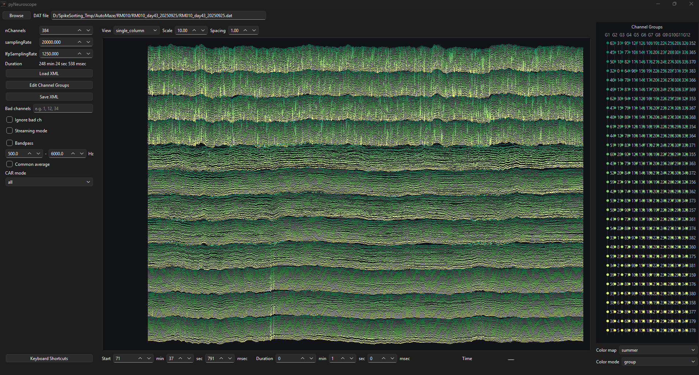

# pyNeuroscope

pyNeuroscope is a Python desktop app inspired by NeuroScope for inspecting electrophysiology recordings, creating NeuroSuite compatible `amplifier.xml` files, and reviewing existing sleep-state annotations.

It is designed for quick visual checks of `amplifier.dat`, explicitly selected `.lfp` files, channel grouping, bad-channel marking, color-map assignment, XML export, multi-subsession recordings, and manual editing of existing `SleepState.states.mat` results.



## Features

- Preview interleaved `int16` `amplifier.dat` recordings by time window.
- Open `.lfp` files explicitly for LFP-rate inspection using `lfpSamplingRate`.
- Set extra ADC channels present at the end of an Open Ephys `continuous.dat` frame so they are used for file reading but hidden from the trace display.
- Switch between single-column and group-column trace views.
- Scroll through time with the time bar or Left / Right keys.
- Change the displayed time window with `Ctrl + mouse wheel` over the traces.
- Adjust trace scale, row spacing, bandpass filtering, and common-average reference.
- Display multi-subsession recordings with session epoch boundaries and overview labels.
- Edit channel groups and inspect groups in the probe viewer.
- Open channel-group XML templates without sampling rates, set the recording
  rates in the GUI, and use `Update XML` for an individual probe.
- Display complete Neuropixels 1.0, 2.0 single-shank, and 2.0 four-shank site
  layouts, with selected physical site IDs mapped to DAT channel order.
- Zoom the probe map with the wheel, pan with right/middle drag, and left-drag
  a rectangle to show only the enclosed active channels. `Show all channels`
  clears the display selection; `Fit probe` resets the map view.
- Choose `per probe` color mode and set an independent colormap for each probe.
- Mark bad channels and save them as `skip="1"` in XML.
- Apply channel colors with selectable color maps.
- Load an existing `SleepState.states.mat` file and edit Wake / NREM / REM labels in the GUI.
- Click state episodes to select ranges, inspect transition timing, and save edits back to disk.
- Adjust spectrogram display with selectable colormaps.
- Choose color mode:
  - `all`: assign the color map across channels in group order.
  - `group`: restart the color map inside each group.
- Save NeuroSuite-style XML with acquisition, LFP, anatomical group, skip, and NeuroScope channel color sections.

## XML Output

Saved XML includes the core fields expected by neurocode and preprocessing tools:

```xml
<parameters>
  <acquisitionSystem>
    <nBits>16</nBits>
    <nChannels>128</nChannels>
    <samplingRate>20000</samplingRate>
    <voltageRange>20</voltageRange>
    <amplification>1000</amplification>
    <offset>0</offset>
  </acquisitionSystem>
  <fieldPotentials>
    <lfpSamplingRate>1250</lfpSamplingRate>
  </fieldPotentials>
  <anatomicalDescription>
    <channelGroups>
      <group>
        <channel skip="0">0</channel>
      </group>
    </channelGroups>
  </anatomicalDescription>
  <neuroscope>
    <channels>
      <channelColors>
        <channel>0</channel>
        <color>#ff00ff</color>
        <anatomyColor>#ff00ff</anatomyColor>
        <spikeColor>#ff00ff</spikeColor>
      </channelColors>
    </channels>
  </neuroscope>
</parameters>
```

When loading an existing XML file, pyNeuroscope preserves acquisition values such as `nBits`, `voltageRange`, `amplification`, and `offset` when saving again.

XML templates may omit `samplingRate` and `lfpSamplingRate`. Loading a template
keeps the current GUI rates and displays a reminder to set the actual recording
rates. `Update XML` writes probe-local channel IDs; `Save Session XML` writes
the combined recording-channel IDs. Missing metadata is not inferred from the
probe type.

## Neuropixels maps

Choose a Neuropixels probe type and set `nChannels` to the number of DAT columns
for that probe. The full physical layout is bundled; selecting a type does not
invent an active recording map. Load the recorded selection using each probe's
`Recording map`. This does not configure the acquisition hardware.

Each probe's `Recording map` accepts `neuropixels_probeN_metadata.json`
(WILDX applied probe receipt version 1), an `.imro` file, a probe-local
`chanMap.mat`, Atlaxis `chanCoords.channelInfo.mat`, or an explicit JSON map.
Neuropixels metadata and IMRO automatically set that probe's type and 384 DAT
columns; a different channel count clears that probe's incompatible XML groups.
WILDX uses `configuration.channels[].output_channel` and `site`; disconnected
and standby channels are excluded from activity without compressing DAT columns.
IMRO channel IDs must match the DAT readout order (no reordered/subset DAT).
NP1 and NP2 single/four-shank IMRO layouts with numeric or part-number headers
are supported; multiple-bank NP2 masks and other physical layouts are rejected.
IMRO field definitions follow the [SpikeGLX documentation](https://billkarsh.github.io/SpikeGLX/help/imroTables/).
Importing a map sorts channels within each group from the top of the displayed
geometry downward, with ties ordered left to right. DAT IDs, group membership,
and the raw recording remain unchanged. Importing a map does not set sampling
rates or gain.
`Load Session ChannelMap`
uses combined DAT channel IDs. Unknown/disconnected rows retain their original
channel numbering. Active/connected flags are separate from bad-channel marking
and the temporary display selection. Left-drag uses a transparent rectangle;
Ctrl+click adds/removes individual channels, and Ctrl+drag adds another range.
The first Ctrl+click starts a selection containing that channel.
Double-click clears an active selection. With no selection, double-clicking a
channel toggles its bad-channel status.

Updating probe XML or saving session XML saves a `.probes.json` companion.
Keep this file alongside its XML to restore probe
types, maps, and probe colormaps. Adjacent Atlaxis `.chanCoords.channelInfo.mat`
companions are also loaded. Rectangle selections are temporary and are not
saved into XML channel groups or bad-channel flags. NP2's 200 µm
tip-to-first-site offset follows Atlaxis and is provisional.

For multiple probes, add one row per probe and load each probe-local XML with
that row's `Probe XML` button. Each XML uses local channel IDs starting at zero;
session XML uses combined DAT IDs. A session XML alone does not identify probe
ownership: keep its `.probes.json` companion to restore multiple probes.
Recording controls scroll vertically when the panel is too short.

Waveform drawing uses peak-preserving display envelopes and cached Qt paths and
images. The original samples remain available to filtering, spectra, and other
analysis. To compare synthetic offscreen drawing with a Git revision, run
`python tools/benchmark_trace_rendering.py --baseline main`; this excludes file
reading and filtering.

`Mode`, to the left of `View`, switches between `trace` and `bitmap`.
Bitmap displays time horizontally and channels vertically using the existing
Color map settings, including per-probe and per-region maps. It retains the
current channel selection/order and single/group-column layout. Channel medians
estimated from representative display samples are removed; one symmetric 98th
percentile amplitude limit is shared across visible channels. `Scale` adjusts
the color contrast (bitmap defaults to `0.8` for a softer display); the displayed
limits are in ADC counts relative to each channel's median. Each time pixel keeps
the strongest signed excursion in its sample bin, and missing bins are transparent. Bitmap images are cached; the
original and processed sample arrays are unchanged. Time/row zoom and event or
spike overlays remain available. CSD overlay is available in trace mode.

`Color mode` selects the cmap controls shown below it: one `Color map` for
`all`/`group`, or individual selectors for `per probe`/`per region`. Switching
modes retains the cmap selections. The amplitude maps `red_white_black` and
`blue_white_black` use the red/blue endpoints of `coolwarm` for negative values,
through white at zero to black for positive values. `coolwarm` uses the standard
[Matplotlib colormap](https://matplotlib.org/stable/gallery/color/colormap_reference.html).

## Install

For normal use, download `pyNeuroscope-Setup.exe` and double-click it.

The installer will:

- install pyNeuroscope for the current Windows user,
- create a desktop shortcut,
- include the `probe_xmls` folder with default probe XML files,
- launch pyNeuroscope after installation.

GitHub Releases also include `pyNeuroscope-Windows.zip` as a portable distribution.
Use this zip if you prefer not to run the installer; extract the archive and run `pyNeuroscope.exe` from the unpacked `pyNeuroscope` folder.

## License

`pyNeuroscope` is distributed under the MIT License. See [LICENSE](LICENSE).

Bundled and runtime third-party dependencies are licensed separately. See
[THIRD_PARTY_NOTICES.md](THIRD_PARTY_NOTICES.md).
